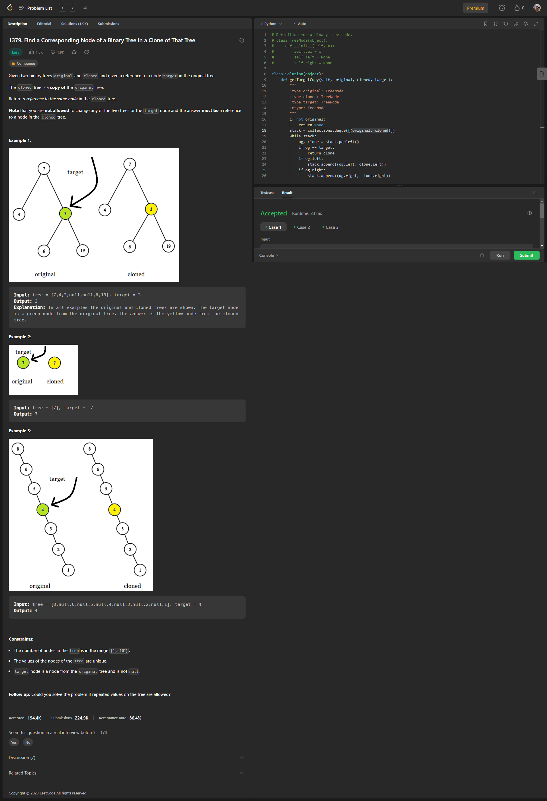

<h2><a href="https://leetcode.com/problems/find-a-corresponding-node-of-a-binary-tree-in-a-clone-of-that-tree/">1379. Find a Corresponding Node of a Binary Tree in a Clone of That Tree</a></h2>
<h3>Easy</h3>

