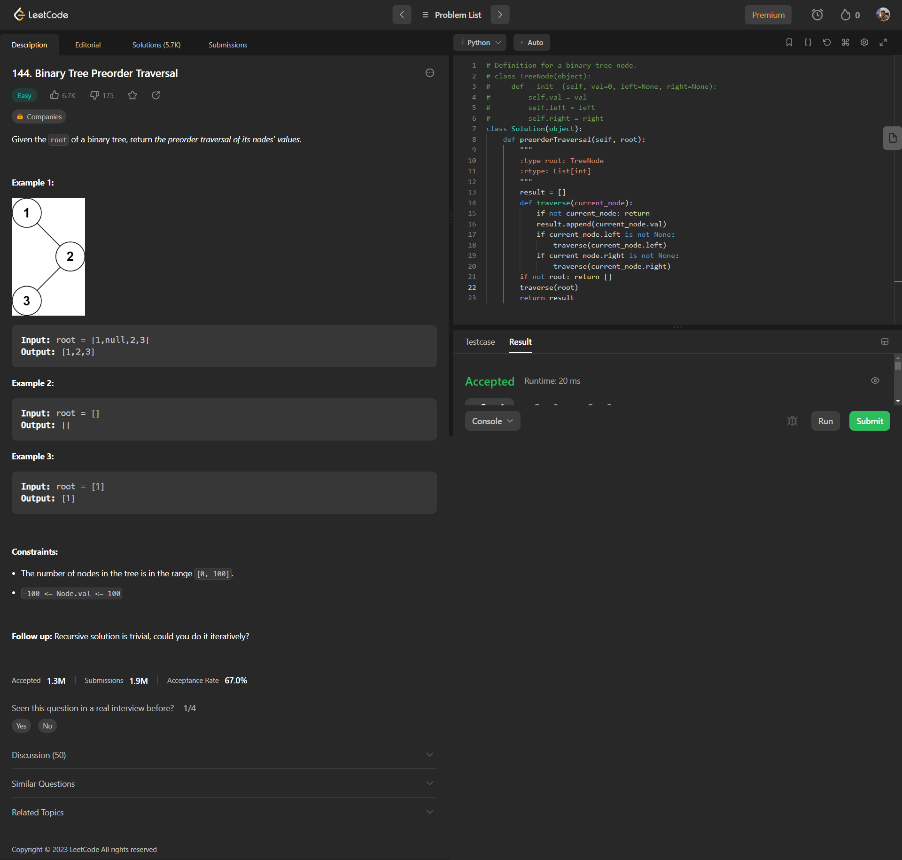

<h2><a href="https://leetcode.com/problems/binary-tree-preorder-traversal/">144. Binary Tree Preorder Traversal</a></h2>
<h3 style="color: #0daa9f; border-radius: 15px; background-color: #223d3a; padding:5px 15px; display: inline-block; font-size:14px; line-height: 14px; font-weight:bold">Easy</h3>

