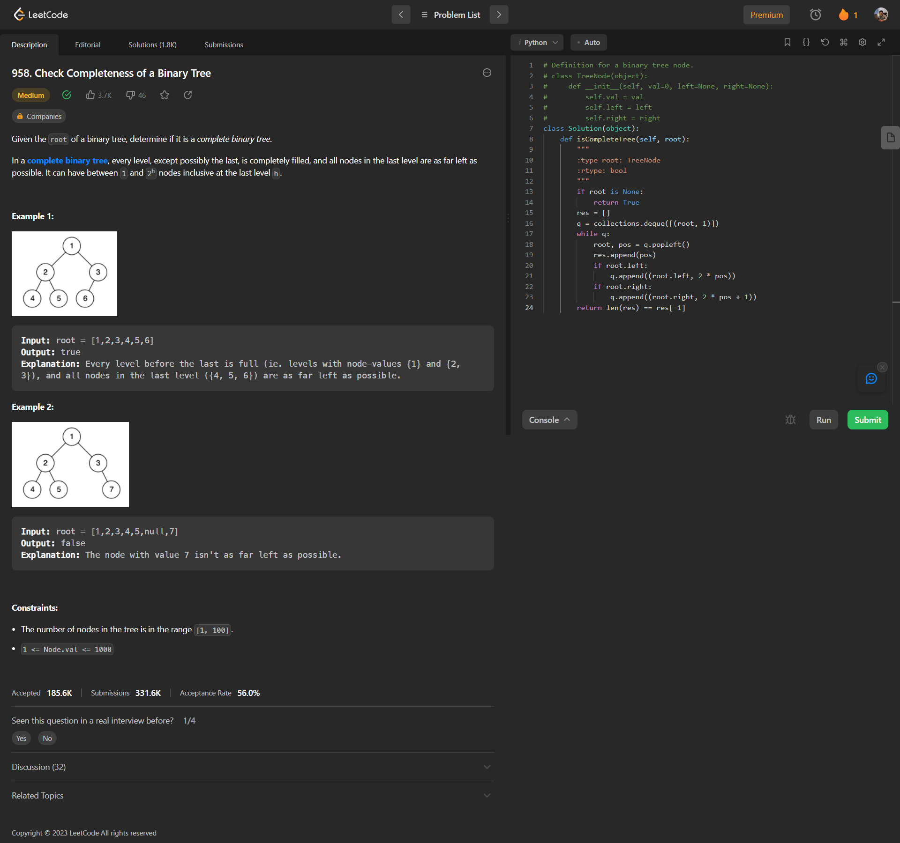

<h2><a href="https://leetcode.com/problems/check-completeness-of-a-binary-tree/description/">958. Check Completeness of a Binary Tree</a></h2>
<h3 style="color: #ffba1f; border-radius: 15px; background-color: #483f26; padding:5px 15px; display: inline-block; font-size:14px; line-height: 14px; font-weight:bold">Medium</h3>

